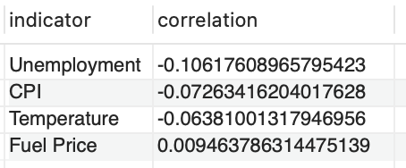

# Sales Analysis using SQL

## 1. Summary of the project

This project analyzes sales data from several Walmart stores to uncover patterns and relationships between sales performance and various economic indicators. Although other programing languages and tools can be used for more advanced analysis, this project is specifically focused on using SQL. The project covered the following: 
- Creating a database structure for the data
- Exploratory data analysis
- Analysis of the correlation between various economic indicators and sales

The analysis revealed that the economic indicators Unemployment rate, consumer price index and temperature have a negative correlation with sales (r = -0.11, r = -0.08, r = -0.07 respectively), while the correlation with fuel price is very low. The analysis also show that store sales tend to increase dramatically before Christmas


## 2. Code and Resources Used

- SQL (MySQL version 5.7.24)
- MySQL Workbench

## 3. Data

The analysis has been conducted using a dataset from Kaggle available [here](https://www.kaggle.com/datasets/mikhail1681/walmart-sales).
The dataset contain sales information from several Walmart stores along with corresponding economic indicators. 
The datasets include the columns listed below:
- Store
- Date
- Weekly_Sales
- Holiday_Flag
- Temperature
- Fuel_Price
- CPI (Consumer Price Index)
- Unemployment

## 4. Project Step-by-Step

### 4.1 Data Inspection and Structure

The project began with inspecting the raw data:

```sql
SELECT *
FROM walmart_sales_raw
LIMIT 10;
```

This allowed for an initial understanding of the data format and content.

### 4.2 Database Structure Creation and Data Cleaning

Three main tables were created to organize the data:
1. Stores
2. Economic_Indicators
3. Sales

```sql
CREATE TABLE Stores (
    store_id INT PRIMARY KEY
);

CREATE TABLE Economic_Indicators (
    indicator_id INT AUTO_INCREMENT PRIMARY KEY,
    date DATE,
    holiday_flag TINYINT,
    temperature DECIMAL(5,2),
    fuel_price DECIMAL(4,3),
    cpi DECIMAL(10,7),
    unemployment DECIMAL(5,3)
);

CREATE TABLE Sales (
    sale_id INT AUTO_INCREMENT PRIMARY KEY,
    store_id INT,
    indicator_id INT,
    weekly_sales DECIMAL(12,2),
    FOREIGN KEY (store_id) REFERENCES Stores(store_id),
    FOREIGN KEY (indicator_id) REFERENCES Economic_Indicators(indicator_id)
);
```

The tables were then populated using the data from the raw dataset


```sql
INSERT INTO Stores (store_id)
SELECT DISTINCT Store
FROM walmart_sales_raw;

-- Similar INSERT statements for Economic_Indicators and Sales tables
```

The data was also checked for any null values

```sql
SELECT 
    'Sales' AS table_name,
    COUNT(*) - COUNT(store_id) AS null_store_id,
    COUNT(*) - COUNT(indicator_id) AS null_indicator_id,
    COUNT(*) - COUNT(weekly_sales) AS null_weekly_sales
FROM Sales
UNION ALL
-- Similar SELECT statements for Stores and Economic_Indicators tables
```
The check revealed no null values in any of the columns across all tables, ensuring data completeness for the analysis.

### 4.3 Exploratory Data Analysis

This section only covers selected highlights from the EDA-part of the project

#### 4.3.1 Basic Data Overview

Initially a few queries were run to better understand the data. Examples include:

```sql
SELECT COUNT(*) FROM Stores;
SELECT MIN(date), MAX(date) FROM Economic_Indicators;
```

These revealed that the data covers 45 stores, and ranges from 2010-02-05 to 2012-10-26.


#### 4.3.2 Descriptive Statistics

Descriptive statistics for the data was calculated by for instance using the following SQL-query

```sql
SELECT 
    AVG(weekly_sales) AS avg_sales,
    MIN(weekly_sales) AS min_sales,
    MAX(weekly_sales) AS max_sales,
    STDDEV(weekly_sales) AS stddev_sales
FROM Sales;
```

Which resulted in the following:


Average weekly sales were $1.05M, with a standard deviation of $564K. The lowest recorded weekly sales were $210K, while the highest were $3.82M

#### 4.3.3 Top Performing Stores

```sql
SELECT 
    s.store_id,
    SUM(s.weekly_sales) AS total_sales
FROM Sales s
GROUP BY s.store_id
ORDER BY total_sales DESC;
```

Store number 20 followed by 4,14 and 13 sold the most over the period analyzed, with store number 20’s sales totaling approximately $603M over the period analyzed

#### 4.5.4 Holiday Impact on Sales

```sql
SELECT 
    e.holiday_flag,
    AVG(s.weekly_sales) AS avg_sales
FROM Sales s
JOIN Economic_Indicators e ON s.indicator_id = e.indicator_id
GROUP BY e.holiday_flag;
```


Sales are on average higher on holidays ($1.12M) compared to non-holidays ($1.04M)

#### 4.5.5 Seasonal Variations

```sql
SELECT 
    MONTH(e.date) AS month,
    AVG(s.weekly_sales) AS avg_sales
FROM Sales s
JOIN Economic_Indicators e ON s.indicator_id = e.indicator_id
GROUP BY MONTH(e.date)
ORDER BY month;
```


Sales show a clear upward peak in November and December, likely due to Christmas shopping.


### 4.6 Correlation Analysis

A comprehensive correlation analysis was performed to understand the relationship between sales and economic indicators. The results can be seen in the table below.



Unemployment showed the strongest negative correlation (r = -0.11) with sales followed by CPI (r = -0.07) and temperature (r = -0.06). This means that a high unemployment rate in the area around the is correlated with low sales. In addition, more sales occur when CPI is low and when it is cold outside (might be because the Christmas shopping occur when it is relatively cold). In a next step it would be interesting to study how sales change based on the difference in temperature compared to the average temperature for that time of the year

## Conclusion

The analysis reveals that the economic indicators Unemployment rate, CPI and temperature have a negative correlation with sales, while the correlation with fuel price is low. Sales also increase dramatically leading up to Christmas. These insights can be used to optimize inventory management and marketing strategies, potentially focusing on weather-based Holiday specific campaigns. In addition, when considering whether to open a new store, the unemployment rate in the surrounding area is a factor highly relevant to account for
